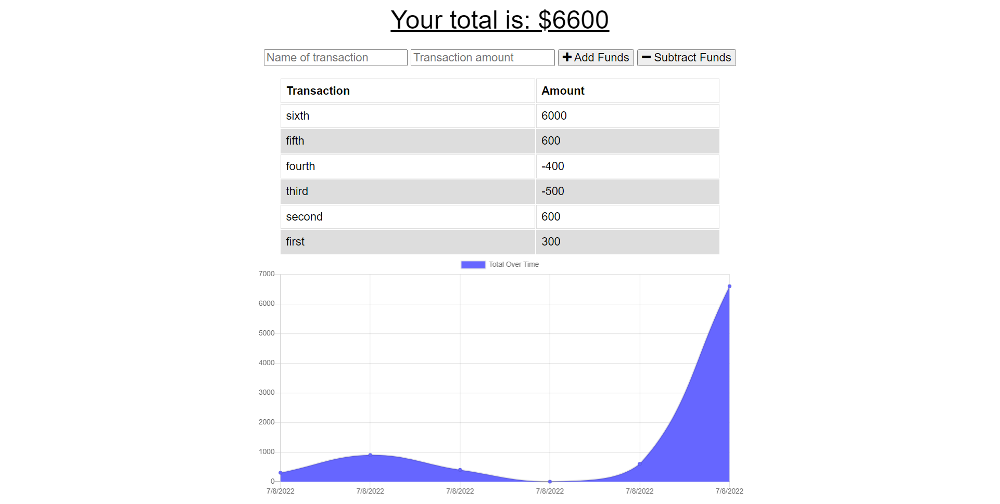

# Budget Tracker 

## Description 
This application allows users to subtract expenses and add deposits to their budget with or without a connection. If the user enters transactions offline, the changes will be stored and then displayed when they're brought back online. This application uses Service workers, IndexDB, MongoDB and Web Manifest for offline functionality and is deployed on Heroku. 

## Table of Contents
* [Installation](#installation)
* [Usage](#usage)
* [License](#license)
* [Contributing](#contributing)
* [Tests](#tests)
* [Questions](#questions)

## Installation 
The user should clone the repository from GitHub and install dependencies `npm i mongoose express compression morgan`. To start server, run `npm start`. 

## Usage 
Deployed application on [Heroku](https://mighty-earth-76606.herokuapp.com/) 

## License 
This project is license under MIT

## Contributing 
Contributors should read the installation section. 

## Tests
N/A

## Questions
If there are any question please reach out to https://github.com/T0rgy